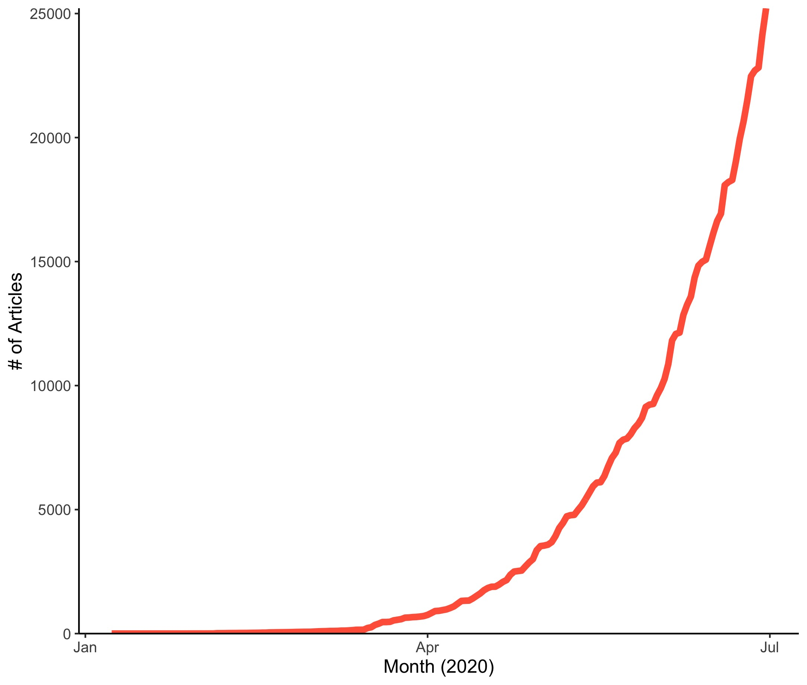

Mark Holmes and Kim Powers recently described the difficulties of developing COVID-19 responses on the rapid timeline that policy makers expect while maintaining the care that effective science requires as akin to “changing your shoes while riding a bicycle during a hurricane.” That is, the ongoing crisis has many moving parts needing immediate attention from policy assessment to vaccine development. On the flip side, scientific norms are often deliberate (slow), cautious (desiring abundant evidence before recommending actions), and conservative (not prone to change). In other words, the demands of the moment are at odds with the culture of science.

Over the past several years, we have spent considerable effort describing the processes that organize scientific communities, and the implications of that organization for how readily researchers coordinate their efforts in efficient and pragmatically beneficial ways---or how barriers limit such efficiency.

COVID-19 science spans numerous domains that are each important for developing an optimal response to slow the spread of the SARS-COV-2 virus and mitigating consequences of the pandemic. In this essay, we focus particularly on one set of questions that are useful for examining how scientific research has mobilized in response to COVID-19. First, we ask how quickly researchers have begun to identify the constellation of topics key to understanding COVID-19. We also turn to how researchers have coordinated efforts to develop and deploy that understanding---with an eye towards whether disciplinary or geographic boundaries have constrained this response. These questions allow us to describe how quickly and efficiently COVID-19 research has mobilized in a time when we truly need all hands on deck.

## Making sense of a new virus
On April 7, New York Times opinion columnist Ross Douthat published a piece titled “In the Fog of Coronavirus, There Are No Experts,” expressing what had become a popular belief — we’re facing a new foe, and don’t really know how to deal with it. Fellow academics have made similar claims in various personal conversations over the past few months, whether in exasperation about the future or as a means to undermine perspectives they simply don’t want to believe. Here’s the thing. There’s a lot of existing expertise that we can — and must —draw on as we figure out how best to handle the pressing questions of COVID-19. Science writer Ed Yong, in part as a direct response to Douthat, made this point forcefully in The Atlantic noting, “The idea that there are no experts is overly glib.”

While we haven’t encountered this particular virus or its specific conditions before, a wide range of existing expertise is directly relevant to optimizing our response to COVID-19. However, what are those expertise domains, and how can we best leverage them today? Further, how have those aims translated into contributions to our collective efforts aimed at curtailing the spread of SARS-COV-2 and its effects? To answer this first question, we describe a combination of (1) the pragmatic and theoretical domains of existing scientific fields pertinent to COVID-19, with (2) an empirical approach for estimating the nature of topics within published scholarship about COVID-19.

## The Need for a Science of Science
A key premise of the push towards interdisciplinary research is that integrative scientific approaches allow for combining knowledge from a range of perspectives in ways that generate more efficient solutions to new problems. That is, mobilization that pulls together researchers from across the scientific spectrum — both substantively and geographically — should accelerate and improve our response to the COVID-19 pandemic. Efficient interdisciplinary research doesn’t combine ideas from the multiplicity of approaches haphazardly; we know what types of questions — and corresponding expertise — are likely to be needed for effective response. An efficient and effective response also requires the cumulation and sequencing of successful research —we need to know some things before we can move onto others.   

To minimize the devastation a new infectious disease can bring, we need to know (among others): the type of biological agent (virus, bacteria, etc.), how it transmits (person-to-person, vector-borne, etc.), and the likelihood and severity of illness-induced (e.g., the case fatality rate). Moreover, each of those has direct implications for developing testing and vaccine capacities, transmission prevention strategies, and treatment protocols. Collectively these concerns carry consequences for — and are shaped by — any number of other domains, particularly including the political and economic, and extending into virtually every aspect of our individual and collective daily experiences. Our research uses a variety of analytic techniques to examine how science is organized, how this science is leveraged to resolve scientific and practical problems, and here, how that has happened in the face of an emerging pandemic. Indeed, COVID-19 has mobilized scientific researchers in unprecedented ways.

## The Growth of COVID-19 Research
The scientific community quickly developed a wide-ranging approach to understanding COVID-19, reflecting interdisciplinary and international collaborative efforts. Our analysis uses data from the National Institutes of Health’s PubMed database. Impressively, COVID-19 research grew exponentially to 25,214 publications by June 30, 2020, indicative of the scientific community’s massive mobilization. 

In the early stages of the pandemic, observers noticed an emerging cluster of unexplained cases of pneumonia-like symptoms in Wuhan, Hubei Province, China. While this sounded early warning bells of the potential for emerging concern, it also pointed to a collection of interrelated questions — what was the source, why was it presenting this way, and why were we seeing it emerge here? Answering these practical questions is tightly connected to a set of related topics in the published literature. Scholars, particularly in China, quickly started examining various outbreaks (a continued focus in literature elsewhere), particularly concerned with identifying the origins of this new illness and describing the common set of symptoms. 

These endeavors quickly led to candidate explanations of a viral source. This is represented in the literature on the molecular genetics of virus identification and corresponding testing assays. In combination, these helped determine that SARS-COV-2 was a zoonotic virus that had transitioned to human-to-human transmission and was initially characterized by a range of respiratory symptoms.

As the early outbreaks in China expanded into a full-blown pandemic, research bases also extended globally. The rapidly emerging science of COVID-19 is truly a global effort, illustrated by the 130 countries represented among the publications’ first authors. Several countries (China, the U.S., Italy, and U.K. in particular) are producing disproportionate contributions to this research, but the distribution across the globe highlights impressive and widespread scientific mobilization.

## Topic Domains in Early Research on COVID-19
Once any disease outbreak starts spreading into new locales, the public, policymakers, and scholars alike become increasingly focused on accounting for how far and how quickly it’s likely to spread. This is represented directly in a quickly burgeoning literature on general surveillance and projections of SARS-COV-2 transmission. This interest in-turn, raises key questions about the course of disease progression that can be expected from those expanding cases. These considerations necessarily combine insights from across scientific fields — ranging, for example, from microbiologists examining the viral structure, combining with system-level immunologists examining how the disease progresses within the body, to clinicians observing (and abating) individual cases symptomatology, and demographers providing statistically robust means for estimating resulting population mortality rates. 

We also know from other diseases that effective treatment also serves to prevent additional transmissions, which COVID-19 research and interventions have sought to leverage. So, not only are researchers reaching across disciplinary boundaries to address each of these and other topics, but the topics essential to understanding an emerging outbreak depend on one another, and our knowledge of each shapes our abilities to address others. 

Our research uses computational techniques, specifically structural topic models, to identify these and other patterns from large collections of texts, here scientific abstracts. These analyses alongside qualitative evaluation provide a means to shed light on the major themes in the early research on this pandemic and how science has evolved during this early period.

During the pandemic’s first six months, researchers quickly observed numerous disparities in the severity of complications that arise from COVID-19. Some of these are associated with longstanding racial, ethnic, and socioeconomic biases in health and health outcomes (e.g., due to racism and discrimination) that appear to be exacerbated by COVID-19, while others are specific to comorbidities that elevate COVID-19’s severity. For example, in addition to respiratory function disorders, heart, kidney, and immunological disorders also exacerbate complications. Media coverage and scientific research also noted locations driving differential risk of transmission, including general elevated risks within healthcare contexts, especially healthcare workers’ higher rates of potential exposure (and thus the importance of personal protective equipment), or prisons where many interventions are neither embraced nor plausible. These are specific examples of a general focus on the contributions of “super spreader events.”

While researchers sought to understand the scope, consequences, and mechanisms of viral contagion and disease severity, they were simultaneously seeking strategies to prevent additional infections. Two key elements of this aspect respectively focused on the development of a vaccine alongside “non-pharmaceutical interventions” (NPIs). Vaccine development folds together some of the same molecular genetic information necessary for developing diagnostic testing, and building on substantial existing immunological knowledge. This work must also determine how long any achieved immunity lasts, whether from recovered infections or vaccines. The most common NPIs — handwashing, social distancing, and face masks —aren’t particularly new in the epidemiological toolkit, but efforts were necessary to evaluate their uptake and efficacy for the particularities of COVID-19. The relative importance of NPIs and vaccines are also compounded as we’ve learned more about morbidity and mortality rates arising from COVID-19.

In addition to the focus on the direct consequences of COVID-19, attention also extends to its broad-reaching indirect implications. For example, in the wake of COVID-19, essentially all elements of healthcare have changed. Treatment regimens and procedures for other conditions have been adapted — an especially robust literature has addressed prenatal health visits and other obstetric care, particularly how to safely maintain delivery services. With “non-essential” services being severely restricted, many other procedures have been postponed or reassessed in how to complete them safely (e.g., orthopedic surgeries). 

Research pays similar attention to the pandemic’s various economic and psychological consequences. Many of these arise from the interventions in place to slow the spread of SARS-COV-2 (e.g., from social distancing measures), necessitating their evaluation. A particular consideration in this vein is the optimization and evaluation of “distance learning” and tele-healthcare delivery that arose from “stay at home” orders. These sets of examples demonstrate just some of the ways that efforts to effectively and quickly curtail the potentially devastating effects of COVID-19 both necessitate drawing together the vast array of applicable scientific resources, and researchers have risen to that challenge.

## Collaboration as Mobilization
The global scientific community has mobilized to understand COVID-19, as illustrated by the considerable breadth of topics engaged by the COVID-19 researchers, but also by the scientific community that has quickly formed in response. We can get a picture of this community by visualizing the network of scientists who coauthor papers together on COVID-19 research. In this network, the nodes (or dots) indicate scientists and the ties (or lines) indicate the number of collaborations between two scientists. These analyses can be quite cumbersome because the data are “messy.” Different scientists may share the same name or abbreviate their institutions differently. We use well-established approaches to address these issues when constructing this network. We find that collaboration within this fast-forming community is robust; only a small fraction of the over 110,000 scientists published articles by themselves and nearly half are linked within a connected portion of this large coauthorship network. While the COVID-19 research community is already large, the connections between groups of scientists remain somewhat fragile with many connected by a single collaboration, a pattern consistent with many large scientific networks. 

This large network is held together by a “backbone” of researchers. This smaller slice shows how individual research teams (the small “starbursts” scattered throughout the network) are loosely connected to one another (the linkages between those stars). Geographic region plays an important role in structuring the scientific collaboration between scientists. For example, scientists from China are more likely to appear on the left side of the network. The green cluster at the center of the graph consists almost entirely of U.S.-based scholars. Geography, however, is only one factor influencing collaboration as can be seen by the geographically diverse purple cluster on the right side of the network. Here, Chinese and American scientists among others collaborate on research related to “risk factor” and “comorbidity” and the clusters with some geographic similarity, like the central green and yellow clusters that are mostly US scholars, exhibit different specialty areas, in this case, disease progression versus virology and genetics.

The ability to mobilize and coordinate quickly and broadly likely stems from the extent of COVID-19’s potential consequences. But, in this case it has also come at the price of a relatively substantial shift in the structure and outlets where scientific advances are shared. Preprints — freely available publications prior to peer review — have become an important way to share new research. This is particularly striking as numerous prominent scientific journals had (and in some cases, still have) refused to publish publicly available preprints. The welcome openness of new data and ideas comes at the corresponding cost of such work not having the vetting that comes with formal peer review. As a result, some have increasingly embraced principles of open science (e.g., data and code sharing), and the infrastructure to support such efforts, such as the open-source collection of genomic data and analyses at NextStrain, or CORD-19’s aggregation of research resources on “COVID-19, SARS-COV-2, and related coronaviruses.”

## The Way Forward
While there are many uncertainties about the nature of a new pathogen and the ensuing COVID-19 pandemic, scientific mobilization that integrates knowledge from across the wide-ranging intersection of applicable expertise optimizes response strategies. Early rapid mobilization seems to be building on these potentialities. However, this mobilization also needs to account for a rapidly changing knowledge base — see, for example, the changing understanding of aerosolized transmission — which leads policymakers and other stakeholders to grapple with how to best make use of this developing science (e.g., changing recommendations about face mask usage). As researchers continue to coordinate these efforts, sociological contributions can continue to identify opportunities for improved social coordination, even while practicing social distancing.

**NOTE: All code necessary to replicate our analyses are available at: https://github.com/jimiadams/Contexts_PubMed.**

*Additional Recommended Resources*

1.	Edelmann, Achim, Tom Wolff, Danielle Montagne, and Christopher A. Bail. 2020. "Computational Social Science and Sociology." Annual Review of Sociology 46: 61-81.
2.	Light, Ryan & jimi adams. 2016. “A Dynamic, Multidimensional Approach to Knowledge Production.” Chapter 6 in Scott Frickel, Mathieu Albert & Barbara Prainsack (eds.) Investigating Interdisciplinary Collaboration: Theory and Practice across Disciplines, Rutgers University Press. https://osf.io/gek68/. 
3.	Brainard, Jeffrey. 2020. “Scientists Are Drowning in COVID-19 Papers. Can New Tools Keep Them Afloat?” Science May 13. doi: 10.1126/science.abc7839. 
4.	Frickel, Scott, and Neil Gross. 2005. "A general theory of scientific/intellectual movements." American Sociological Review 70(2): 204-232.
5.	Roberts, Margaret E., Brandon M. Stewart, and Edoardo M. Airoldi. 2016. "A model of text for experimentation in the social sciences." Journal of the American Statistical Association 111(515) 988-1003.

